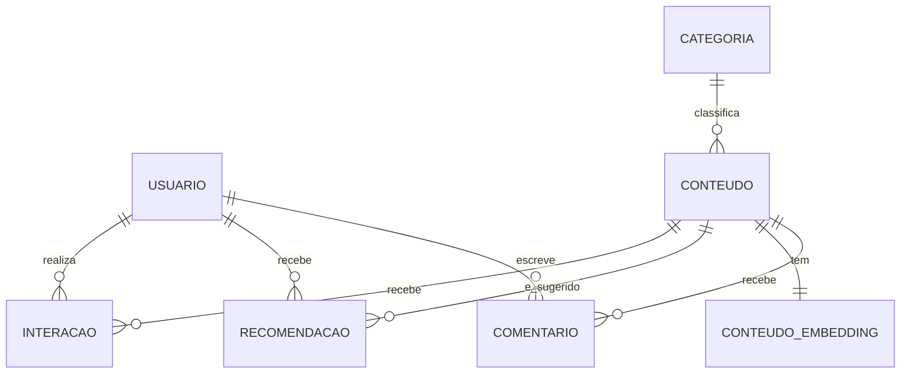

# Modelo de dados — Desafio 1

Entregável da seção 11 do enunciado. O modelo lógico executável está em
[`sql/criar_banco.sql`](../sql/criar_banco.sql); este documento explica o **porquê** de
cada entidade.

Tudo vive no schema `desafio`, dentro do banco das aulas. Schema em vez de banco novo
porque o usuário do PostgreSQL não tem `rolcreatedb` — e o schema dá o mesmo isolamento,
permitindo recriar tudo do zero sem sudo.

## Modelo conceitual



`COMENTARIO` está pontilhado no sentido de que **não é tabela do PostgreSQL**: mora no
MongoDB, coleção `comentarios`. A justificativa está abaixo.

## Modelo lógico

```mermaid
erDiagram
    CATEGORIA {
        int categoria_id PK
        text nome UK
    }
    USUARIO {
        int usuario_id PK
        timestamp primeira_atividade "derivada"
        timestamp ultima_atividade "derivada"
    }
    CONTEUDO {
        int conteudo_id PK
        text titulo
        text tipo "Curso|Vídeo|Artigo|Podcast"
        int categoria_id FK
        text nivel "Básico|Intermediário|Avançado"
        int carga_horaria_min "> 0"
        date data_publicacao
        text descricao
        text autor
    }
    INTERACAO {
        bigserial interacao_id PK
        int usuario_id FK
        int conteudo_id FK
        text tipo_interacao "6 valores"
        timestamp data_hora
        numeric tempo_consumido ">= 0"
        numeric percentual_conclusao "0 a 100"
        numeric avaliacao_atribuida "1 a 5, NULL permitido"
    }
    CONTEUDO_EMBEDDING {
        int id PK_FK
        text conteudo "título + descrição"
        vector embedding "384 dimensões"
        text modelo
        timestamp gerado_em
    }
    RECOMENDACAO {
        bigserial recomendacao_id PK
        int usuario_id FK
        int conteudo_id FK
        numeric pontuacao
        int posicao
        text classificacao "Positivo|Estável|Negativo"
        timestamp gerado_em
    }

    CATEGORIA ||--o{ CONTEUDO : ""
    USUARIO ||--o{ INTERACAO : ""
    CONTEUDO ||--o{ INTERACAO : ""
    CONTEUDO ||--|| CONTEUDO_EMBEDDING : ""
    USUARIO ||--o{ RECOMENDACAO : ""
    CONTEUDO ||--o{ RECOMENDACAO : ""
```

## Decisões do modelo

### `usuario` é derivada

Nenhuma das três fontes traz dados de usuário — só o `usuario_id` referenciado. O RF06
exige a entidade, então ela sai de `SELECT DISTINCT usuario_id` das duas fontes JSON:
150 identificadores, contíguos de 1 a 150. As colunas de data são calculadas a partir da
atividade. É lacuna do enunciado, não esquecimento nosso.

### `categoria` é dimensão, não texto repetido

O catálogo traz `categoria` como texto em cada linha. Normalizamos numa dimensão de 8
linhas, com `conteudo.categoria_id` apontando para ela — assim renomear uma categoria é
um `UPDATE` numa linha, e um valor fora do domínio é barrado pela FK.

### A `UNIQUE` de `interacao` não é `(usuario_id, conteudo_id)`

O mesmo usuário visualizar e depois concluir o mesmo conteúdo são **dois fatos
legítimos**. A chave é `(usuario_id, conteudo_id, tipo_interacao, data_hora)` — o que
caracteriza duplicata é repetir também o tipo e o instante. Em `comentarios`, aí sim, a
chave é `(usuario_id, conteudo_id)`, e é por ela que os 6 duplicados reais aparecem.

### `avaliacao_atribuida` aceita `NULL` de propósito

São 644 das 1000 interações, e a ausência é semanticamente correta: só existe nota
quando o tipo de interação é avaliação. O `CHECK (avaliacao_atribuida BETWEEN 1 AND 5)`
só se aplica quando há valor — em SQL, `NULL` não viola `CHECK`.

### `conteudo_embedding` usa `id`, não `conteudo_id`

É o formato que `toolkit.vetorial.indexar_textos` espera. Reaproveitar a função valia
mais que a consistência do nome; a FK para `conteudo(conteudo_id)` está lá, e as colunas
`modelo` e `gerado_em` atendem a exigência do RF08 de registrar qual modelo produziu
cada vetor.

### `recomendacao` guarda histórico

A `UNIQUE (usuario_id, conteudo_id, gerado_em)` permite várias gerações convivendo e
impede a mesma recomendação repetida dentro de uma execução. Para a última geração:

```sql
SELECT * FROM desafio.vw_recomendacoes
 WHERE gerado_em = (SELECT MAX(gerado_em) FROM desafio.recomendacao);
```

### Por que os comentários foram para o MongoDB

São o único dado do desafio com forma de documento: texto livre de tamanho variável mais
um array de tags. No relacional, `tags` exigiria tabela de associação e um JOIN para a
pergunta mais comum ("quais comentários têm a tag X"); no Mongo é um índice sobre array.

Cada documento carrega `categoria`, `tipo` e `titulo` copiados do catálogo —
desnormalização deliberada, sem a qual a agregação por categoria exigida pelo RF07
dependeria de dado que só existe no outro banco.

## Views (RF12 e RF13)

| View | Serve a |
|---|---|
| `vw_metrica_volume_interacoes` | métrica operacional 1 |
| `vw_metrica_consumo_por_categoria` | métrica operacional 2 |
| `vw_kpi_taxa_conclusao` | KPI 1 + gráfico de barras |
| `vw_kpi_cobertura_catalogo` | KPI 2 + gráfico de barras |
| `vw_dashboard_interacoes` | fato desnormalizado: cartões, linhas e os 2 filtros |
| `vw_recomendacoes` | conferência do RF11 |
| `vw_indicadores_gerais` | uma linha com os números de acompanhamento |

Os filtros nativos do Superset só alcançam gráfico cujo dataset tem a coluna filtrada —
por isso os três cartões saem de `vw_dashboard_interacoes`, e não da
`vw_indicadores_gerais`: assim mexer no filtro de categoria muda os cartões junto com os
gráficos.
